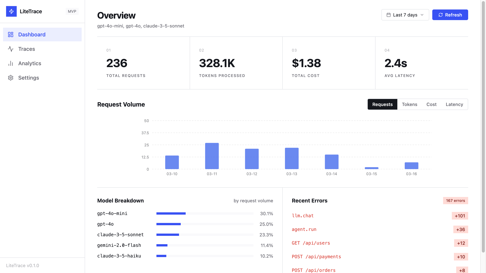
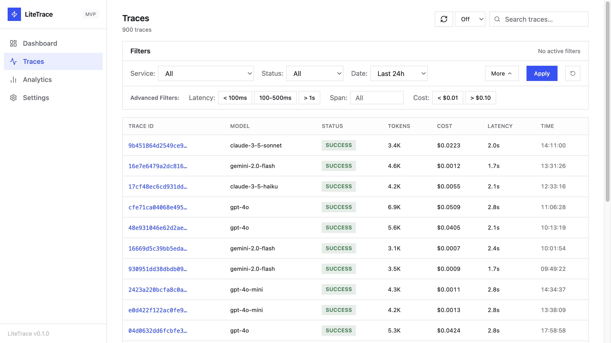
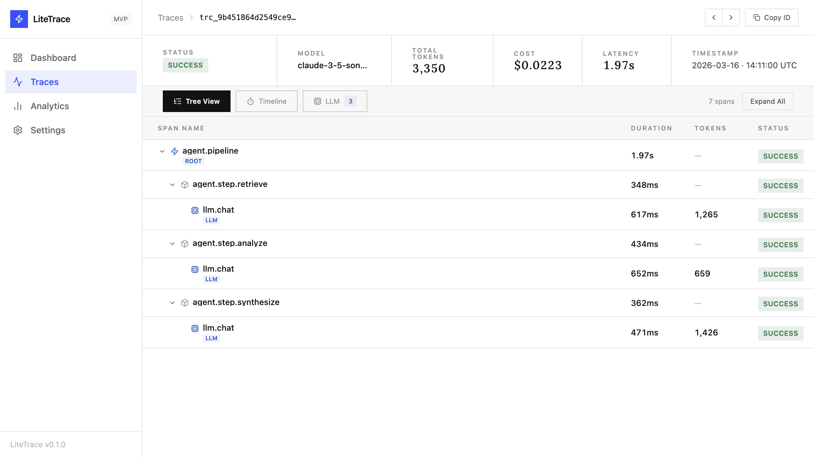
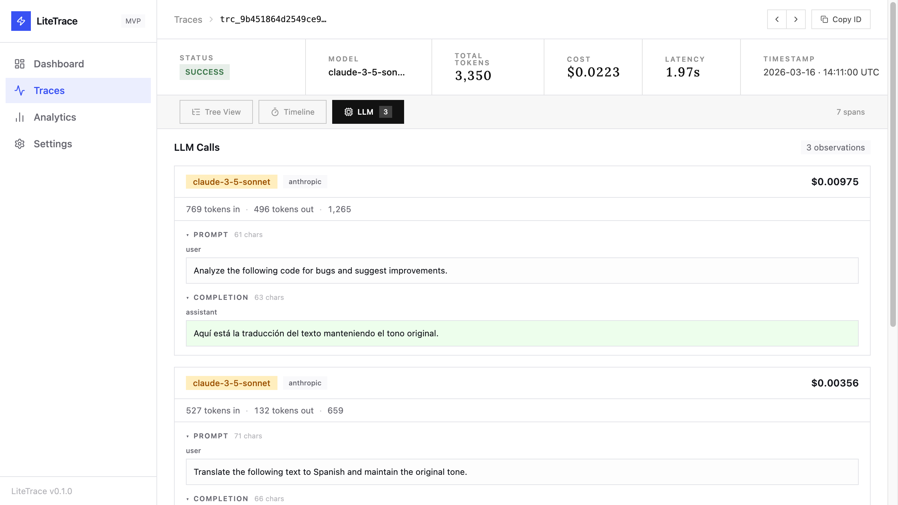
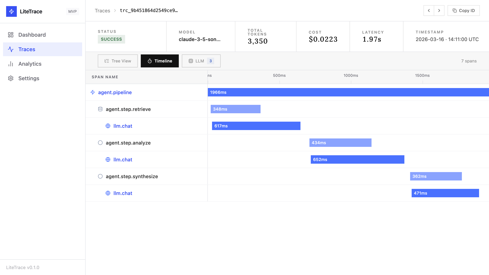

[](https://github.com/raysca/litetrace/actions/workflows/ci.yml)
[](LICENSE)

# LiteTrace

The simplest way to get observability into your LLM app — token counts, cost tracking, and full trace inspection in under a minute.

One `docker run`. No config files. No cloud accounts. No per-seat pricing.



## Why LiteTrace?

You're building an LLM app and need to answer questions like:
- *How much did that pipeline run cost?*
- *Which model is burning the most tokens?*
- *Why did that agent chain take 4 seconds?*

LiteTrace gives you those answers immediately. It speaks OpenTelemetry natively, so if you're already using the OTEL SDK, you're two lines away from full observability.

## Quick Start

**Docker (recommended):**

```bash
docker run -p 3000:3000 -p 4317:4317 -p 4318:4318 ghcr.io/raysca/litetrace:latest
```

Open http://localhost:3000, then point your OTLP exporter at:
- HTTP: `http://localhost:4318`
- gRPC: `localhost:4317`

**Python (opentelemetry-sdk):**

```python
from opentelemetry.sdk.trace import TracerProvider
from opentelemetry.exporter.otlp.proto.http.trace_exporter import OTLPSpanExporter

provider = TracerProvider()
provider.add_span_processor(
    BatchSpanProcessor(OTLPSpanExporter(endpoint="http://localhost:4318/v1/traces"))
)
```

**Node.js:**

```js
import { OTLPTraceExporter } from "@opentelemetry/exporter-trace-otlp-http";

const exporter = new OTLPTraceExporter({ url: "http://localhost:4318/v1/traces" });
```

**From source:**

```bash
git clone https://github.com/raysca/litetrace
cd litetrace && bun install && bun run dev
```

## Screenshots

| Dashboard | Traces | Detail |
|-----------|--------|--------|
|  |  |  |

| LLM Observations | Timeline |
|------------------|----------|
|  |  |

## Features

- **Zero config** — SQLite database created automatically on first run
- **OTLP native** — gRPC (4317) and HTTP/JSON + Protobuf (4318)
- **LLM cost tracking** — auto-detects LLM spans, extracts token counts, calculates cost per model
- **Span tree explorer** — full span hierarchy with prompt/completion viewer
- **Timeline view** — waterfall chart of span durations
- **Trace filtering** — filter by service, status, latency range, cost, and span name
- **SQLite by default** — switch to PostgreSQL with one config line
- **Single binary** — one `bun` process, zero external dependencies
- **Fast** — 100,000+ spans/sec on a single core

## LLM Support

Auto-detects and enriches spans from any model using OpenTelemetry semantic conventions:

| Provider | Models |
|----------|--------|
| OpenAI | gpt-4o, gpt-4o-mini, gpt-4, gpt-3.5-turbo, o1, o3 |
| Anthropic | claude-3-5-sonnet, claude-3-5-haiku, claude-3-opus |
| Google | gemini-2.0-flash, gemini-1.5-pro, gemini-1.5-flash |
| Any OTLP-compatible | via `gen_ai.*` semantic conventions |

## Configuration

Create `config.yaml` (or mount at `/app/config.yaml` in Docker):

| Key | Default | Description |
|-----|---------|-------------|
| `server.port` | `3000` | Web UI + API port |
| `otlp.grpcPort` | `4317` | OTLP/gRPC port |
| `otlp.httpPort` | `4318` | OTLP/HTTP port |
| `storage.path` | `litetrace.db` | SQLite file path |
| `auth.enabled` | `false` | Enable Bearer token auth |

**Docker Compose with persistent storage:**

```yaml
services:
  litetrace:
    image: ghcr.io/raysca/litetrace:latest
    ports:
      - "3000:3000"
      - "4317:4317"
      - "4318:4318"
    volumes:
      - litetrace-data:/app/data
    environment:
      - LITETRACE_STORAGE_PATH=/app/data/litetrace.db

volumes:
  litetrace-data:
```

## API Key Auth

Set `auth.enabled: true` in `config.yaml`, then open Settings in the UI to create API keys. Send traces with `Authorization: Bearer <key>`.

## Benchmarks

OTLP/HTTP ingestion, 10 spans/request, 1 vCPU / 2 GB RAM:

| Concurrency | Req/s | Spans/s | p50 | p95 |
|-------------|-------|---------|-----|-----|
| 5 | 3,200 | 32,000 | 1.4ms | 3.8ms |
| 20 | 8,100 | 81,000 | 2.3ms | 6.1ms |
| 50 | 11,400 | 114,000 | 4.2ms | 9.8ms |
| 100 | 12,300 | 123,000 | 7.8ms | 16.2ms |

## Why not just use X?

Most observability tools make you provision infrastructure before you can see a single trace. LiteTrace doesn't.

| Tool | Steps to first trace | LLM cost tracking |
|------|---------------------|-------------------|
| **LiteTrace** | **1** — `docker run` | ✓ |
| Jaeger | 4 — container + collector + storage + config | — |
| Langfuse | 6 — PostgreSQL + Redis + server + env + API key + SDK | ✓ |
| Grafana Tempo | 6+ — Tempo + Grafana + config YAML + datasource + dashboards + retention | — |

**LiteTrace**: 1 command, 0 config files, 0 external databases, running in under 60 seconds.

## Development

```bash
bun install
bun run dev          # hot-reload dev server on :3000
SKIP_E2E=1 bun test  # unit + integration tests
bun scripts/bench.ts # benchmark (requires running server)
```

## License

[MIT](LICENSE)
